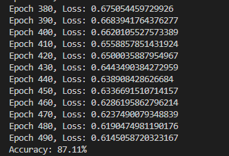
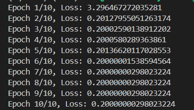

# Comparison of Approaches for Optical Character Classification

## Exercise 1: Basic Machine Learning with KNN

### Approach

K-Nearest Neighbors (KNN) is a simple yet effective classification algorithm. It operates on the principle that data points close to each other in feature space are likely to belong to the same class.
- **Data:** The MNIST dataset is used for training and testing the model. The data is divided into feature points (images of digits) and labels (corresponding digits).

### Model training results

### Benefits
- **Simplicity and Understandability:** KNN is easy to implement and understand, requiring no complex training.
- **No Training Required:** KNN does not require a formal training process; it simply stores the training set and performs comparisons during prediction.

### Drawbacks
- **Poor Performance with Large Data:** KNN can struggle with large datasets because it needs to compute distances between the test point and all training points, leading to poor performance and long prediction times.
- **Limited Fine-Tuning Capability:** KNN does not learn features from data, so it cannot improve through training iterations like other machine learning models.

## Highlight

Triplet Loss is typically used to train Siamese networks in classification tasks based on similarity and dissimilarity between samples, rather than simple classification tasks. Therefore, Exercise 3 utilized Siamese networks with Triplet Loss.

## Exercise 3: Deep Learning with Siamese Networks and Triplet Loss

### Approach

Siamese Networks are a type of neural network designed to learn embeddings for data points. This network consists of two branches sharing weights, each receiving input and computing embeddings for samples.
- **Triplet Loss:** This loss function is used to optimize the embedding space so that similar points are closer together and dissimilar points are farther apart. It uses three samples: anchor, positive, and negative.

### Model training results

### Benefits
- **Better Recognition Capability:** Siamese Networks with Triplet Loss learn to better distinguish between similar and dissimilar characters, making the model more effective at recognizing variations in optical characters.
- **Optimized Embedding Space:** Triplet Loss optimizes the embedding space to ensure points of the same class are close together and points of different classes are farther apart, improving classification accuracy in the embedding space.
- **Improved Generalization:** Siamese Networks with Triplet Loss can generalize better to unseen samples, which is particularly useful in tasks with significant variability between samples.

### Drawbacks
- **Complexity and Time Consumption:** Implementing and training Siamese Networks with Triplet Loss is more complex compared to KNN. Selecting and fine-tuning triplets (anchor, positive, negative) also requires careful consideration.
- **Training Time Required:** The model needs time to train to optimize embeddings and Triplet Loss, which can be computationally expensive.

### Comparison

- **Classification Capability:** Siamese Networks with Triplet Loss generally achieve better performance when distinguishing between similar and dissimilar samples in the embedding space, whereas KNN may struggle with variability in data.
- **Performance and Resources:** KNN is simple and easy to implement but is not suitable for large datasets. Siamese Networks with Triplet Loss require more computational resources but offer improved classification accuracy and generalization.
- **Practical Applications:** In real-world scenarios with high variability and fine distinction requirements, Siamese Networks with Triplet Loss offer clear advantages over KNN.

## Alternatives to Triplet Loss for Optical Character Classification

Here are some alternative approaches to Triplet Loss for optical character classification:

- **Cross-Entropy Loss with Convolutional Neural Networks (CNNs):** CNNs with cross-entropy loss are commonly used for classification tasks and can effectively handle the MNIST dataset by learning spatial hierarchies in images.

- **Data Augmentation:** Enhancing the training data with various transformations (e.g., rotation, scaling) can improve the model's ability to generalize and perform better on unseen data.

- **Transfer Learning:** Leveraging pre-trained models on similar tasks and fine-tuning them on the specific optical character classification task can provide significant performance improvements, especially when labeled data is limited.

- **Deep Feature Learning:** Employing deep learning architectures that learn rich features from data can enhance classification accuracy by capturing complex patterns and variations in the images.

- **Supervised Learning with Fully Connected Networks:** Traditional fully connected neural networks can also be applied to classification tasks, providing a baseline or alternative approach to more complex models.
