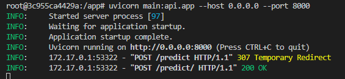
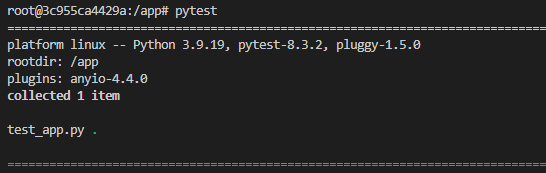
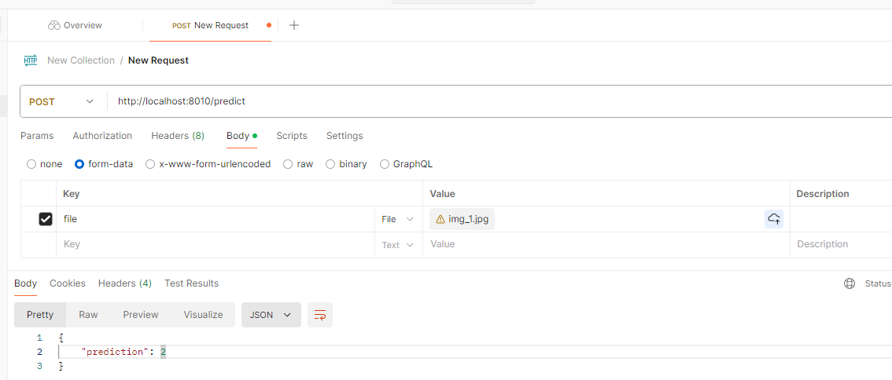
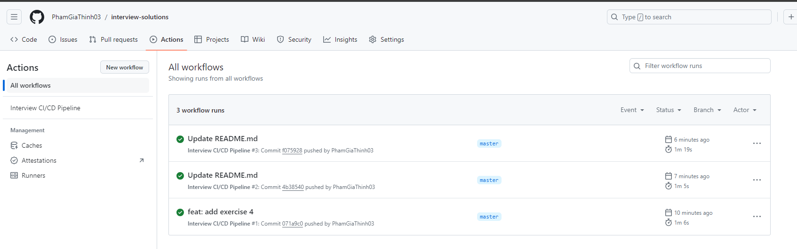
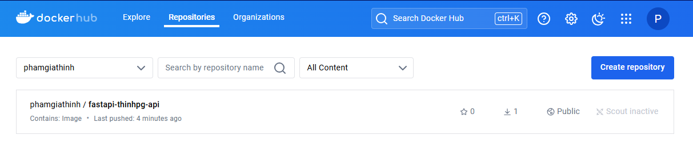

## Run Dockerfile:
- docker build -t thinhpg.
- docker run -it --rm -p 8010:8000 --name=thinhpg -v ./:/app fastapi-thinhpg-api

## Run an ASGI
 - uvicorn main:api.app --host 0.0.0.0 --port 8000 

## Run pytest
- pytest

## CI/CD
 - POST: http://localhost:8010/predict

